Notes app for Android. It is built with Dart on top of Google's Flutter Framework.

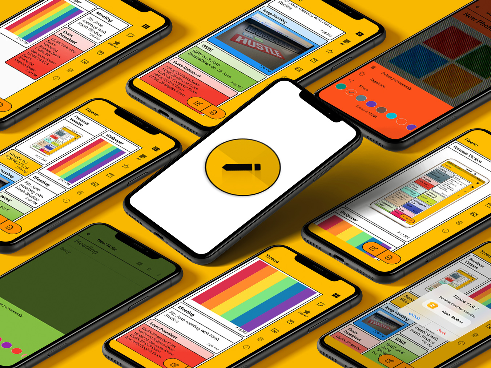

## List of Contents

1. [Features](#features)
2. [Demo](#demo)
3. [Dependencies](#dependencies)
4. [Usage](#usage)
5. [Development](#development)
6. [License](#license)
7. [Contributors](#contributors)
8. [To-Do](#to-do)

## Features

- Create long text notes
- Secure data storage on SQLite
- View notes as Staggered Tiles or List Tiles
- Create photo notes
- Mark notes as important/star
- Archive older notes
- Delete individual notes or all notes
- Robust data storing, works even if you delete photos
- Toast/Snackbar supported buttons
- Supports Google Fonts universally
- Minimal design with smooth transitions
- Undo to previous saved iteration
- Duplicate notes with one-tap
- View last edited time/date
- Optimised storage using minimal packages
- Application size under 10 MB
- Beautiful Amber color UI

## Demo

**Screens**

| 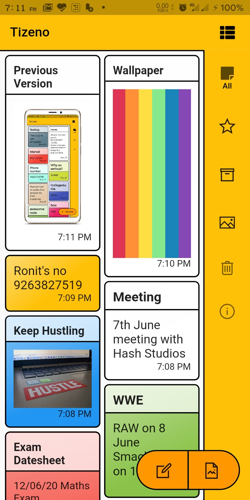 | 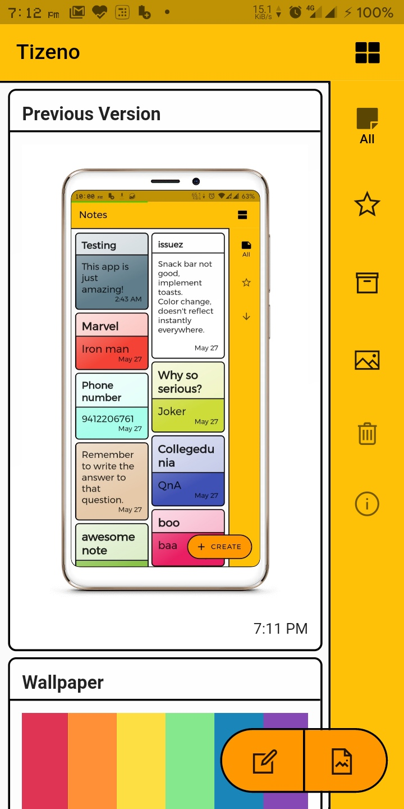 | 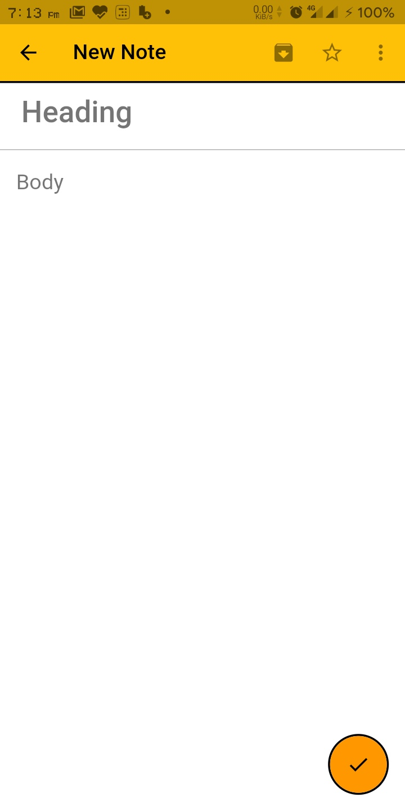 | 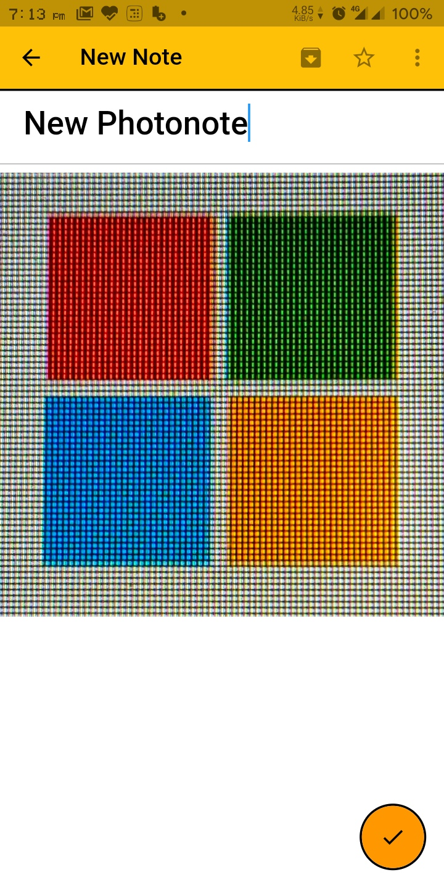 | 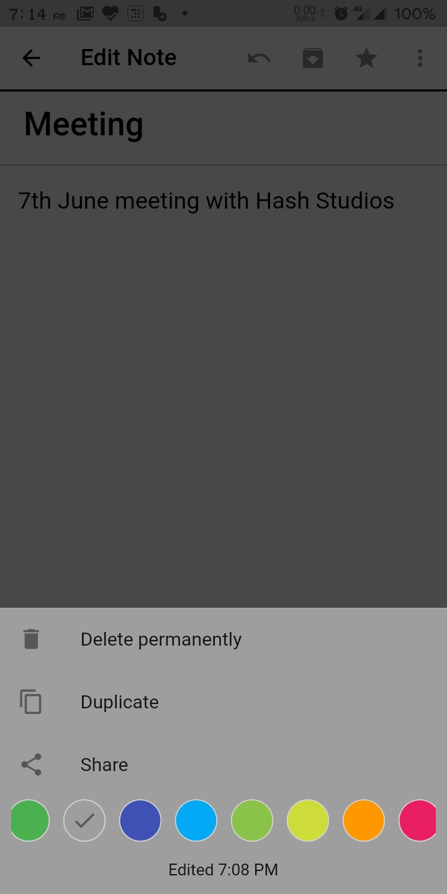 |
| :-------------: | :-------------:  | :-------------:  | :-------------:  | :-------------:  |
|     Main Screen     |    Main List Screen    |    New Note    |     New Photo Note       |     Edit note     |

| 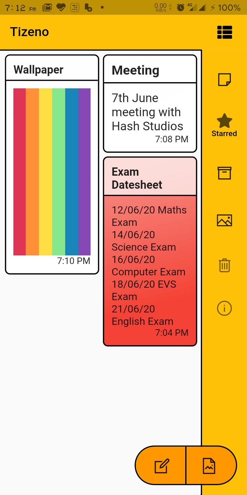 | 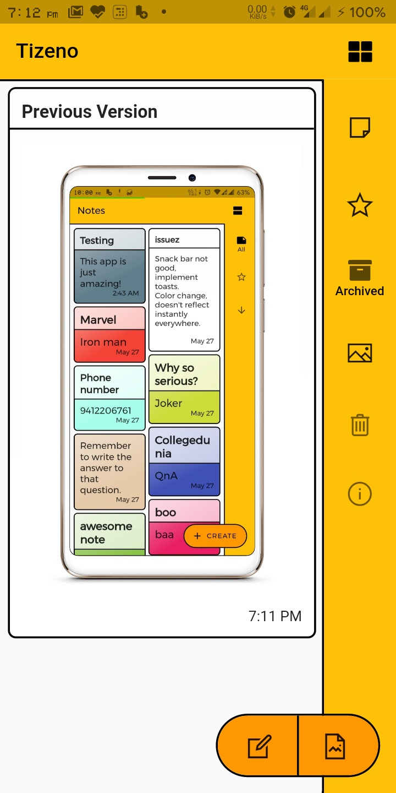| 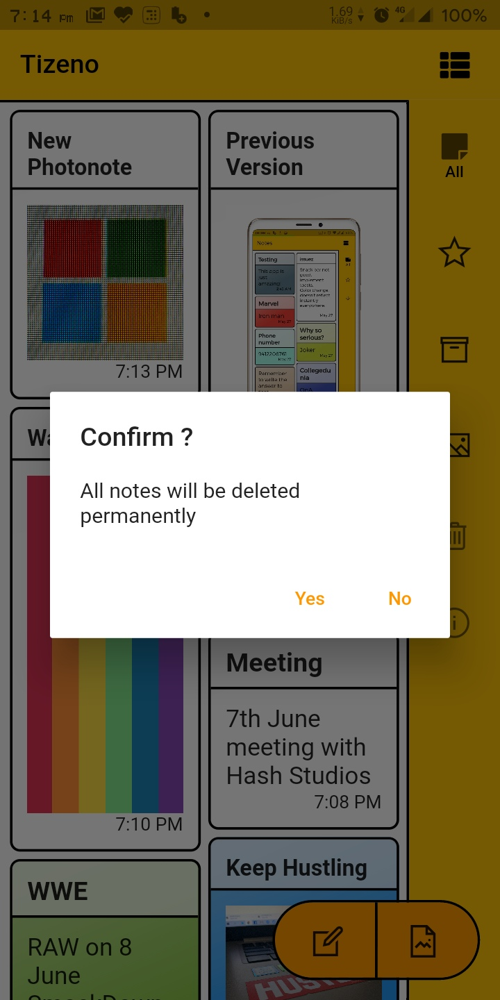| 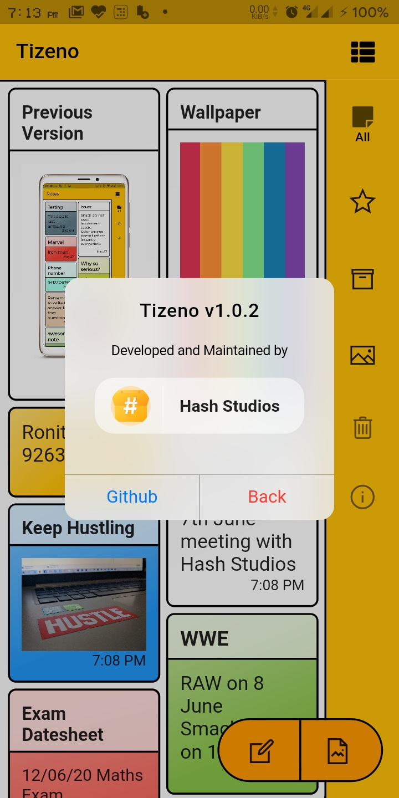 | 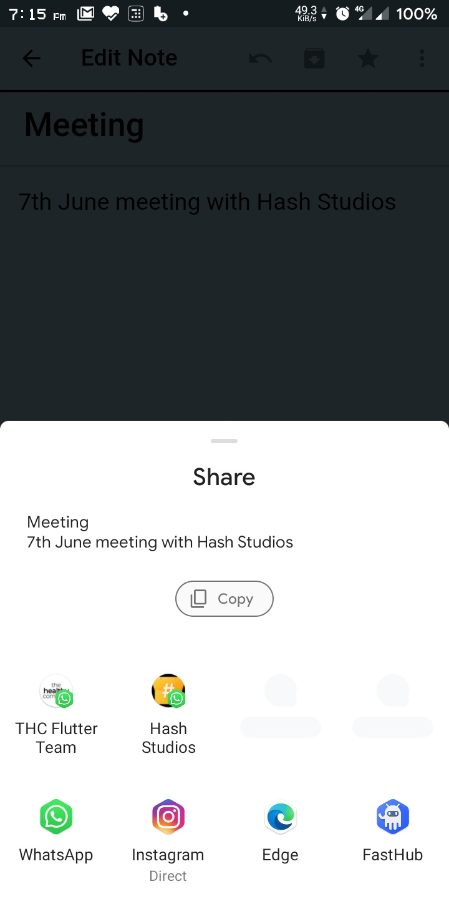|
| :-------------:  | :-------------: | :-------------: | :-------------:  | :-------------: |
|  Starred Notes  |Archived Notes|  Delete All    |      About   |      Share  |

## Dependencies

The following packages are needed for the development of this application.

- `flutter_staggered_grid_view: ^0.3.0`
- `sqflite: ^1.3.0+1`
- `auto_size_text: ^2.1.0`
- `intl: ^0.16.1`
- `google_fonts: ^1.1.0`
- `flutter_screenutil: ^1.1.0`
- `image_picker: ^0.6.7`
- `font_awesome_flutter: ^8.8.1`
- `line_awesome_icons: ^1.0.4+2`
- `gallery_saver: ^2.0.1`
- `url_launcher: ^5.4.10`
- `photo_view: ^0.9.2`
- `flutter_share_content: ^0.2.1+1`
- `cupertino_icons: ^0.1.2`
- `provider: ^3.1.0`
- `share: ^0.6.4+3`

More details about these can be found in the [`pubspec.yaml`](https://github.com/Hash-Studios/flutter-notes-app/tree/master/pubspec.yaml) file.

## Development

Start by forking the repository, and then run `flutter pub get` in the local repository. You are now ready to modify, fix, update, or remove any feature in the app. If you want, you can create pull requests, we will be happy to welcome them.
>Note: This project requires Flutter Framework to be installed on your machine.

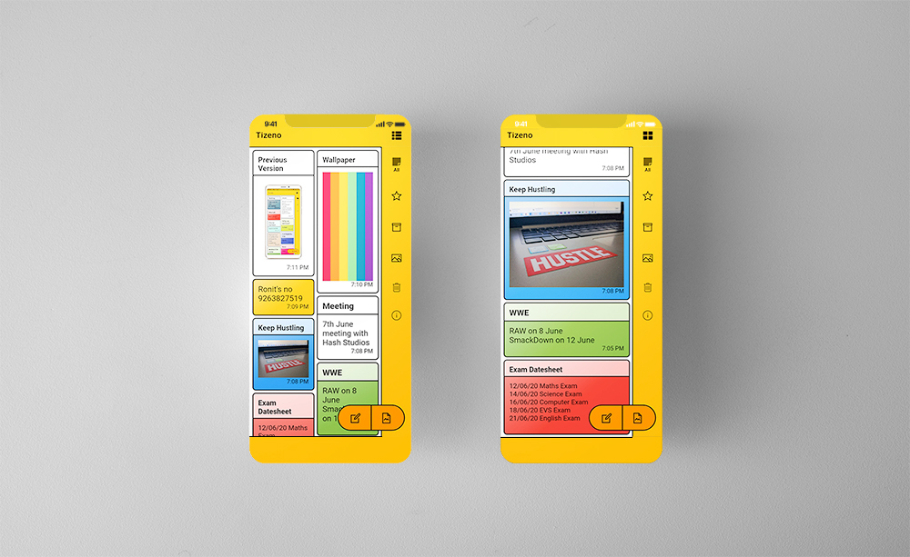
